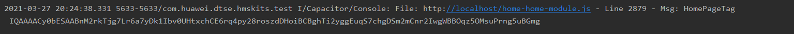
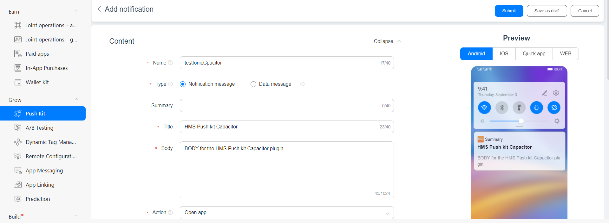
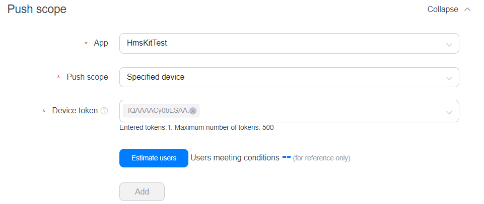
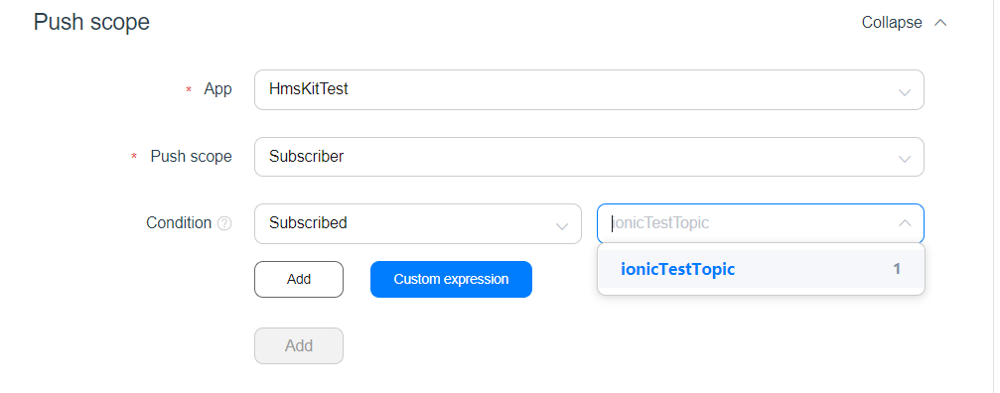
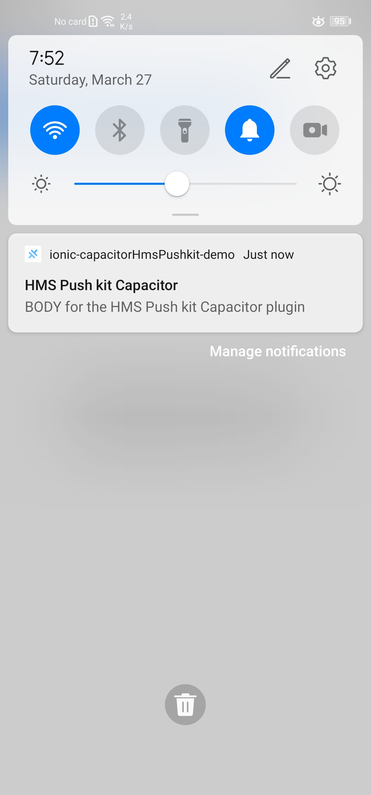

# HUAWEI Push Kit - Capacitor Plugin

A Capacitor Plugin to use the following [HUAWEI Push Kit](https://developer.huawei.com/consumer/en/hms/huawei-pushkit)


## Content
* [Preparation](#preparation)
* [API](#api)
* [Example](#example)
* [Sending push messages](#sending-push-messages)


## Preparation
### Console Side Preparation
- Before using Push Kit, enable it. For details, please refer to [Enabling Required Services](https://developer.huawei.com/consumer/en/doc/development/HMSCore-Guides-V5/android-config-agc-0000001050170137-V5#EN-US_TOPIC_0000001078601380__section9471122085218).
- Run the keytool command to get the SHA256 fingerprint from the keystore: 
```bash
keytool -list -v -keystore hms_test.jks
```
>Note: Replace **hms_test.jks** with your keystore path
>Note: Make sure to use this keystore even in while debug
- Obtain the SHA256 fingerprint from the result:


- On the AppGallery Connect (AGC) console of [HUAWEI Developer](https://developer.huawei.com/consumer/en/), Select your project or create a new one if you didn't do yet, then:
    -    In to the tab **Project Setting** > **General information** past the obtained SHA256 fingerprint, Click √ to save the fingerprint and download then the `agconnect-services.json` file.


### App Side Preparation (Please refer to the following [Demo](https://github.com/ikamaru/ionic-capacitorHmsPushkit-demo))
- Add the plugin to your project using the following command:
```bash
npm install https://github.com/ikamaru/capacitor-hms-push-kit/
``` 
>Note: Sync after installing the plugin using the cmd: `npx cap sync android` 
- After enabling the Push Kit make sure to re-download the `agconnect-services.json` and past it to the **android/app** folder of your capacitor project.
- In the **android/build.gradle** file, make sure to  add the following lines: 
```Groovy
buildscript {
    repositories {
        //...
        maven {url 'https://developer.huawei.com/repo/'} //TODO: add this line
    }
    dependencies {
        //...
        classpath 'com.huawei.agconnect:agcp:1.4.1.300' //TODO: add this line
    }
}
allprojects {
    repositories {
        //...
        maven {url 'https://developer.huawei.com/repo/'} //TODO: add this line
    }
}
```
- In the **android/app/build.gradle** file,make sure to add the following code in the bottom:
```Groovy
try {
  def servicesJSON = file('agconnect-services.json')
  if (servicesJSON.text) {
    apply plugin: 'com.huawei.agconnect'
  }
} catch(Exception e) {
  logger.warn("agconnect-services.json not found, agconnect-services plugin not applied. Push Notifications won't work")
}
```

- In the **MainActivity.java** of your android app (android/app/src/main/java/{APP_ID}/MainActivity.java), add the following line inside the bridge init:
```java
this.init(savedInstanceState, new ArrayList<Class<? extends Plugin>>() {{
    add(PushKit.class);//Add the following line
}});
```
Example:
```java
import com.ikamaru.capacitor.hms.push.kit.PushKit;

public class MainActivity extends BridgeActivity {
  @Override
  public void onCreate(Bundle savedInstanceState) {
    super.onCreate(savedInstanceState);

    // Initializes the Bridge
    this.init(savedInstanceState, new ArrayList<Class<? extends Plugin>>() {{
      add(PushKit.class);//Add the following line
    }});
  }
  
}
```

## Api
| Method        | Info                                   | Parameters          | Return                        |
|:-------------:| ---------------------------------------|:-------------------:|:-----------------------------:|
| `getToken`    | Get HMS Push Kit token                 | `void`              | `Promise<{ token: string }>`  |
| `subscribe`   | Subscribe to an HMS Push Kit topic     | `{ topic: string }` | `Promise <void>`              |
| `unsubscribe` | Unsubscribe from an HMS Push Kit topic | `{ topic: string }` | `Promise <void>`              |

## Example
```TS
import { Component } from '@angular/core';

import { Plugins } from '@capacitor/core';
//import "capacitor-hms-push-kit";
const { PushKit } = Plugins;//import the PushKit plugin

@Component({
  selector: 'app-home',
  templateUrl: 'home.page.html',
  styleUrls: ['home.page.scss'],
})
export class HomePage {
  TAG:string="HomePageTag";
  topic:string="ionicTestTopic";

  constructor() {
    //Get HMS Push Kit token   
    PushKit.getToken().then(res=>{
      console.log(this.TAG,res.token);//Log the received token
    }).catch(err=>{
      console.error(this.TAG,err);//Log the err in case the token couldn't be received 
    });
  }
  subscribeToTopic(){
    //Subscribe to an HMS Push Kit topic 
    PushKit.subscribe({topic: this.topic}).then(()=>{
      console.log(this.TAG,"subscribe Done");//Log that the subscription has been done successfully 
    }).catch((err)=>{
      console.error(this.TAG,err);//Log that the subscription failed
    }) 
  }
  unsubscribeFromTopic(){
    //Unsubscribe from an HMS Push Kit topic 
    PushKit.unsubscribe({topic: this.topic}).then(()=>{
      console.log(this.TAG,"subscribe Done");//Log that the unsubscription has been done successfully 
    }).catch((err)=>{
      console.error(this.TAG,err);//Log that the unsubscription failed
    }) 
  }
}
```
## Sending push messages
### Using HTTPS requests 
Push Kit supports HTTPS for sending both uplink and downlink messages, for more detail please refer to the following [documentation](https://developer.huawei.com/consumer/en/doc/development/HMSCore-Guides-V5/android-server-dev-0000001050040110-V5).

###  Using the Console
To test your app you can send messages on the Push Kit console in AppGallery Connect as described below:
- Sign in to [AppGallery Connect](https://developer.huawei.com/consumer/en/service/josp/agc/index.html), select My projects, and find your project in the project list. Go to Project settings > Grow > Push Kit > Notifications. Click Add notification to create a task.
- For more detail refer to the following [guide](https://developer.huawei.com/consumer/en/doc/development/HMSCore-Guides-V5/msg-sending-0000001050042119-V5).

In the previous example we did print the token in log, copy that token:



Fill the Notification information:



You can send Push notification or data message:
- To specified device using the token we copied:



- To subscribers:



- Result:


